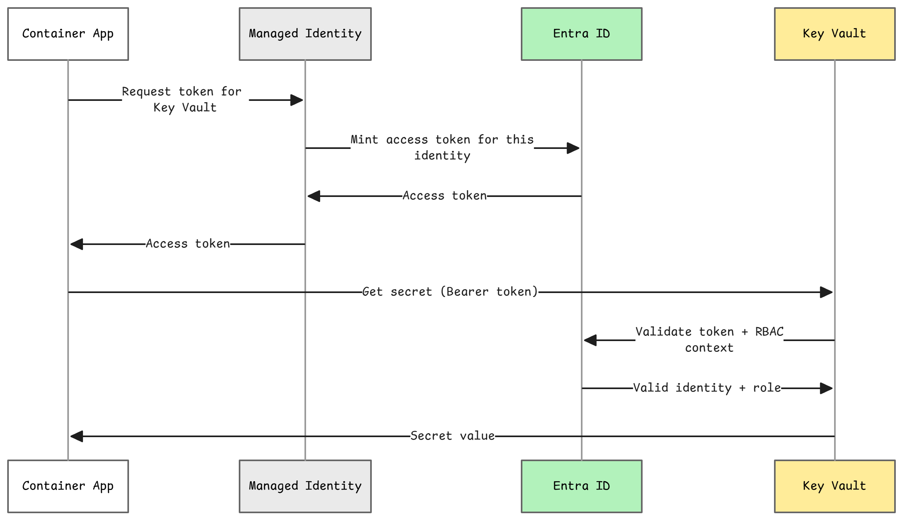

---
hide:
  - toc
---

<div class="camp-banner">
  <div class="camp-banner-content">
    <div class="camp-banner-text">
      <div class="camp-banner-label">Camp 1 · Managed Identity</div>
      <h1>Enable Managed Identity</h1>
      <p>Replace connection strings with passwordless identity-based authentication for Azure resources.</p>
    </div>
    <div class="camp-banner-image">
      <span class="banner-icon"><span class="material-icons">badge</span></span>
    </div>
  </div>
</div>

You've seen how the **vulnerable server** exposes tokens and lacks proper authentication. Now it's time to harden the **secure server** by giving it a passwordless identity in Azure.

??? info "What is Managed Identity?"
    { .center width=720 }

    **Azure Managed Identity** eliminates passwords and keys by having Azure automatically manage credentials for you:

    - +mdi:check+ **No secrets to store** - Azure handles authentication
    - +mdi:check+ **No secrets to rotate** - Azure manages the lifecycle
    - +mdi:check+ **Uses Azure RBAC** - Permissions controlled by role assignments
    - +mdi:check+ **Works with many Azure services** - Key Vault, Storage, Cosmos DB, etc.

    **How it works:**

    1. Your Container App has a **Managed Identity** (automatically created)
    2. You grant that identity **RBAC permissions** (e.g., "Key Vault Secrets User")
    3. Your code uses `DefaultAzureCredential()` - automatically picks up the identity
    4. No passwords, no keys, no secrets!

## Waypoint 3: Enable Managed Identity

From this waypoint forward, all steps focus on the secure server:

- **Waypoint 3:** Enable Managed Identity (passwordless Azure authentication)
- **Waypoint 4:** Migrate secrets to Key Vault
- **Waypoint 5:** Configure OAuth 2.1 with JWT validation
- **Waypoint 6:** Validate the security improvements

The vulnerable server stays unchanged—it's your "before" snapshot for comparison.

---

### Verify Managed Identity Setup

Your infrastructure already created the Managed Identity during the provision process. Let's verify it:

=== "Bash"
    ```bash
    cd camps/camp1-identity
    ./scripts/enable-managed-identity.sh
    ```

=== "PowerShell"
    ```powershell
    cd camps/camp1-identity
    ./scripts/enable-managed-identity.ps1
    ```

This script:

- Loads your azd environment variables
- Verifies the Managed Identity exists
- Confirms RBAC role assignments to Key Vault

**Expected output:**

```
Camp 1: Enable Managed Identity
==================================
Loading azd environment...
Managed Identity Principal ID: xxxxxxxx-xxxx-xxxx-xxxx-xxxxxxxxxxxx

🔍 Verifying Key Vault role assignment...
Role                        Scope
--------------------------  --------------------------------------------------
Key Vault Secrets User      /subscriptions/.../providers/Microsoft.KeyVault/...

Managed Identity setup complete!
The Container App can now access Key Vault secrets without passwords.
```

---

### Understanding the Security Improvement

**Before (vulnerable):**
```python
# Hardcoded connection string - BAD!
CONNECTION_STRING = "DefaultEndpointsProtocol=https;AccountName=...;AccountKey=EXPOSED_KEY..."
client = BlobServiceClient.from_connection_string(CONNECTION_STRING)
```

**After (secure with Managed Identity):**
```python
from azure.identity import DefaultAzureCredential

# No secrets! Managed Identity authenticates automatically
credential = DefaultAzureCredential()
client = BlobServiceClient(account_url="https://storage.blob.core.windows.net", credential=credential)
```

---

### How This Protects You

| Threat | Before | After |
|--------|--------|-------|
| Credential theft | Keys in env vars | No keys to steal |
| Rotation burden | Manual rotation | Azure auto-rotates |
| Portal exposure | Visible to readers | Not visible (identity reference only) |
| Code leaks | Keys in repo | No keys in code |
| Over-privileged | Often admin keys | Least-privilege RBAC |

---

### Next Step

Managed Identity is configured! Now let's use it to access Key Vault in Waypoint 4.
