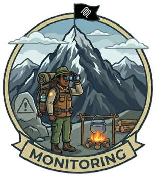

---
hide:
  - toc
---

<div class="camp-banner">
  <div class="camp-banner-content">
    <div class="camp-banner-text">
      <div class="camp-banner-label">Camp 4</div>
      <h1>Monitoring & Telemetry</h1>
      <p>Prove your defenses work with Log Analytics, Application Insights, dashboards, and automated alerting — because security without observability is blind.</p>
    </div>
    <div class="camp-banner-image">
      
    </div>
  </div>
</div>

### Welcome to Observation Peak!

You've made it to Camp 4, the last skill-building camp before the Summit! Throughout your journey, you've locked down authentication, put a gateway in front of your MCP servers, and added input validation and output sanitization. Your servers are now protected by multiple layers of defense.

But here's a question: **How do you know it's working?**

If an attacker probed your system last night, would you know? If your security function blocked 100 injection attempts yesterday, could you prove it to an auditor? If there's a sudden spike in attacks right now, would you be alerted?

This is where **observability** comes in, and it's just as important as the security controls themselves.

!!! quote "The Key Insight"
    Security controls without observability are like locks without security cameras. You might stop the intruder, but you'll never know they tried to get in.

!!! info "Camp Details"
    **Tech Stack:** Log Analytics, Application Insights, Azure Monitor, Workbooks, API Management, Container Apps, Functions, MCP
    **Primary Risks:** [MCP08](https://microsoft.github.io/mcp-azure-security-guide/mcp/mcp08-telemetry/) (Lack of Audit and Telemetry), [MCP04](https://microsoft.github.io/mcp-azure-security-guide/mcp/mcp04-supply-chain/) (Software Supply Chain Attacks & Dependency Tampering)

---

## What You'll Build

By the end of Camp 4, every request will be logged, visualized, and alertable. Here's the complete architecture:

```
                      +---------------------+
                      |      MCP Client     |
                      +----------+----------+
                                 |
                                 | HTTPS Request
                                 v
+--------------------------------+-----------------------------+
|                API Management (APIM Gateway)                 |
|                                                              |
|  +--------------------------------------------------------+  |
|  | Layer 1: Prompt Shields (AI Content Safety)            |  |
|  |   - Scans for prompt injection attacks                 |  |
|  |   - Blocks jailbreak / manipulation attempts           |  |
|  |   - Logs via <trace> policy --> AppTraces              |  |
|  |       +- Properties.event_type (direct)                |  |
|  +--------------------------------------------------------+  |
|                                                              |
|  - Receives all MCP traffic                                  |
|  - Applies policies (auth, rate limiting)                    |
|  - Generates CorrelationId for distributed tracing           |
|  - Routes clean requests to security function                |
|                                                              |
|         Diagnostic Settings --> Log Analytics                |
|           +- GatewayLogs                (HTTP details)       |
|           +- GatewayLlmLogs             (LLM usage)          |
|           +- WebSocketConnectionLogs    (WebSocket events)   |
+--------------------------------+-----------------------------+
                                 |
                                 | (if not blocked by Layer 1)
                                 v
+--------------------------------+-----------------------------+
|                  Security Function (Layer 2)                 |
|                                                              |
|   - Receives forwarded request + CorrelationId               |
|   - Regex checks: SQL / path traversal / shell injection     |
|   - Scans responses for PII and credentials                  |
|   - Emits structured events with custom dimensions           |
|                                                              |
|         Application Insights SDK --> AppTraces table         |
|           +- Properties.custom_dimensions.event_type         |
|           +- Properties.custom_dimensions.injection_type     |
|           +- Properties.custom_dimensions.correlation_id     |
+--------------------------------------------------------------+
```

You'll wire up structured logging, build a security dashboard with Azure Workbooks, create alert rules that fire when attacks spike, and learn KQL to investigate incidents across services.

!!! info "Supply Chain Coverage (MCP04)"
    Camp 4's telemetry is the watchtower over this workshop's defense against **[MCP04: Software Supply Chain Attacks & Dependency Tampering](https://microsoft.github.io/mcp-azure-security-guide/mcp/mcp04-supply-chain/)**:

    - **Image versioning & signing** via Azure Container Registry (deployed in every camp's infrastructure) — every MCP server image is tagged, immutable, and pulled by digest.
    - **Sandboxed execution** behind APIM and Container Apps — compromised dependencies can't reach beyond the workload boundary.
    - **Audit telemetry** (this camp) — anomalous outbound calls, unexpected process behavior, and dependency drift surface in Log Analytics and trigger alerts.

    Together, these controls turn supply chain risk from "invisible until breach" into a detectable, governable signal.

---

## Prerequisites

Before starting Camp 4, ensure you have:

- +mdi:check+ Azure subscription with Contributor access
- +mdi:check+ Azure CLI installed and logged in (`az login`)
- +mdi:check+ Azure Developer CLI installed (`azd auth login`)
- +mdi:check+ Docker installed and running (for Container Apps deployment)
- +mdi:check+ Completed Camp 3: I/O Security (recommended, but not required)

- +mdi:arrow-right+ [Full prerequisites guide](../../prerequisites.md) with installation instructions for all tools.

---

## Getting Started

```bash
# Navigate to Camp 4
cd camps/camp4-monitoring

# Deploy infrastructure AND services (~15 minutes)
azd up
```

This deploys an APIM gateway, security functions (v1 with basic logging, v2 with structured logging), a Log Analytics workspace, Application Insights, and the MCP server and Trail API on Container Apps.

!!! tip "Windows Users"
    All scripts in this camp have PowerShell equivalents (`.ps1`). When you see `./scripts/X.sh`, you can run `./scripts/X.ps1` instead.

!!! tip "Just want the full solution?"
    Skip the workshop and deploy everything at once — dashboards, alerts, and structured logging included. See [Production Deployment](production-deploy.md).

Once deployment completes, you're ready to start the workshop. Camp 4 follows the **hidden → visible → actionable** pattern — you'll explore what's already logging, make hidden events visible, then turn that visibility into dashboards and alerts.

Ready? Let's start by exploring what API Management is already logging.
