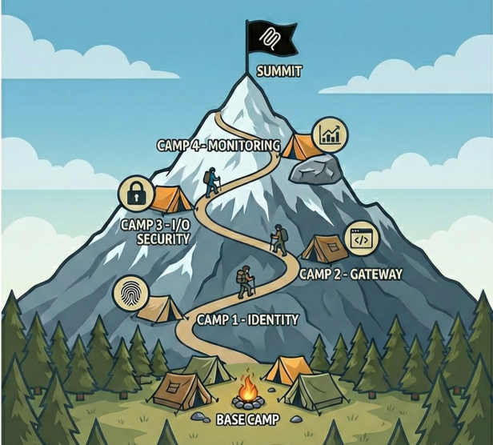

<div class="sherpa-home">

<section class="sherpa-hero-scroll" data-sherpa-hero-phase="start" data-sherpa-frame-count="118" data-sherpa-frame-path="images/herosection/ezgif-frame-{index}.jpg" data-sherpa-start-frame="images/startframe.png" data-sherpa-end-frame="images/endframe.png" aria-label="MCP Security Summit Workshop introduction">
  <div class="sherpa-hero-sticky">
    <canvas class="sherpa-hero-canvas" aria-hidden="true"></canvas>
    <div class="sherpa-hero-loader" role="status" aria-live="polite">
      <span class="sherpa-hero-loader__label">Loading expedition</span>
      <span class="sherpa-hero-loader__percent">0%</span>
    </div>
    <div class="sherpa-hero-content">
      <h1 class="sherpa-hero-copy sherpa-hero-copy--start"><span>MCP Security</span><span>Summit <em>Workshop</em></span></h1>
      <div class="sherpa-hero-copy sherpa-hero-copy--end">
        <p>Secure MCP servers in Azure through hands-on exploitation and remediation. Break things, fix them, ship production-ready code.</p>
        <a href="camps/base-camp/" class="sherpa-hero-cta liquid-glass">Begin Journey</a>
      </div>
    </div>
    <a class="sherpa-scroll-cue" href="#why-this-workshop" data-sherpa-scroll="#why-this-workshop" aria-label="Scroll to why this workshop">
      <span aria-hidden="true"></span>
    </a>
  </div>
</section>

<section id="why-this-workshop" class="sherpa-why-band">

<h2>Why This Workshop</h2>

<div class="why-feature-grid">

<div class="why-feature-card">
  <span class="why-feature-icon material-icons" aria-hidden="true">track_changes</span>
  <h3>Learn by Breaking</h3>
  <p>Exploit intentionally vulnerable servers, then fix them with Azure-native security: <strong>vulnerable &rarr; exploit &rarr; fix &rarr; validate</strong> methodology.</p>
</div>

<div class="why-feature-card">
  <span class="why-feature-icon material-icons" aria-hidden="true">menu_book</span>
  <h3>OWASP-Aligned</h3>
  <p>Every technique maps to the <a href="https://microsoft.github.io/mcp-azure-security-guide/">OWASP MCP Azure Security Guide</a> for industry-standard coverage.</p>
</div>

<div class="why-feature-card">
  <span class="why-feature-icon material-icons" aria-hidden="true">verified_user</span>
  <h3>Azure-Native Security</h3>
  <p>Entra ID, Key Vault, API Management, AI Content Safety, and Log Analytics — production services, not toy demos.</p>
</div>

</div>

</section>

</div>

<div class="sherpa-home-content" markdown="1">

## The Expedition Route

<div class="route-feature-section" markdown="0">

<div class="route-feature-intro">
  
  <p>Each camp builds on the last — from unauthenticated MCP servers to enterprise-grade defense-in-depth.</p>
</div>

<div class="route-feature-grid">

<a href="camps/base-camp/" class="route-feature-card">
  <div class="route-card-decorator" aria-hidden="true">
    <span class="material-icons">landscape</span>
  </div>
  <div class="route-card-title">Base Camp</div>
  <p>Explore MCP fundamentals and witness authentication vulnerabilities in action. Your starting point for the expedition.</p>
  <span class="route-card-tag">No Azure required</span>
</a>

<a href="camps/camp1-identity/" class="route-feature-card">
  <div class="route-card-decorator" aria-hidden="true">
    <span class="material-icons">visibility</span>
  </div>
  <div class="route-card-title">Camp 1: Identity</div>
  <p>OAuth 2.1 with PKCE, Azure Managed Identity, and Key Vault secrets management. Lock down who can access your MCP server.</p>
  <span class="route-card-tag">Authentication &middot; Authorization</span>
</a>

<a href="camps/camp2-gateway/" class="route-feature-card">
  <div class="route-card-decorator" aria-hidden="true">
    <span class="material-icons">router</span>
  </div>
  <div class="route-card-title">Camp 2: MCP Gateway</div>
  <p>API Management gateway, Private Endpoints, and API Center governance. Control the front door to your MCP servers.</p>
  <span class="route-card-tag">Networking &middot; Governance</span>
</a>

<a href="camps/camp3-io-security/" class="route-feature-card">
  <div class="route-card-decorator" aria-hidden="true">
    <span class="material-icons">shield</span>
  </div>
  <div class="route-card-title">Camp 3: I/O Security</div>
  <p>Prompt injection defense, PII detection, and Azure AI Content Safety integration. Protect what goes in and comes out.</p>
  <span class="route-card-tag">Input validation &middot; Content safety</span>
</a>

<a href="camps/camp4-monitoring/" class="route-feature-card">
  <div class="route-card-decorator" aria-hidden="true">
    <span class="material-icons">analytics</span>
  </div>
  <div class="route-card-title">Camp 4: Monitoring</div>
  <p>Log Analytics, custom dashboards, and automated threat detection. See everything, miss nothing.</p>
  <span class="route-card-tag">Observability &middot; Alerting</span>
</a>

<a href="camps/summit/" class="route-feature-card">
  <div class="route-card-decorator" aria-hidden="true">
    <span class="material-icons">flag</span>
  </div>
  <div class="route-card-title">The Summit</div>
  <p>Red Team / Blue Team exercise validating all security layers end-to-end. Full integration test.</p>
  <span class="route-card-tag">Capstone exercise</span>
</a>

</div>

</div>

---

## Quick Start

From clone to running lab in under ten minutes.

**1. Clone the repository**

```bash
git clone https://github.com/Azure-Samples/sherpa.git
cd sherpa
```

**2. Install dependencies & verify**

```bash
curl -LsSf https://astral.sh/uv/install.sh | sh
python --version  # 3.10+
az account show   # logged in
```

**3. Start at Base Camp**

Open the [Base Camp guide](camps/base-camp.md) and follow along. The docs tell you when to deploy and test code from the repo.

!!! info "First time?"
    Check the **[Prerequisites](prerequisites.md)** for full setup instructions and system requirements. No security expertise required — if you can write Python and navigate the Azure Portal, you're ready.

---

## References

+mdi:book+ [OWASP MCP Azure Security Guide](https://microsoft.github.io/mcp-azure-security-guide/) — Companion guide referenced throughout
+mdi:file-document+ [MCP Specification](https://modelcontextprotocol.io/specification/2025-11-25) — Official protocol documentation
+mdi:github+ [FastMCP Framework](https://github.com/jlowin/fastmcp) — Python framework used in this workshop

</div>

</div>
