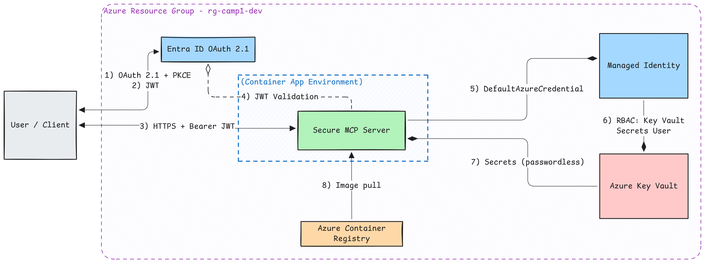
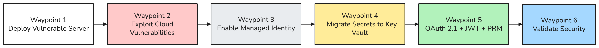

---
hide:
  - toc
---

<div class="camp-banner">
  <div class="camp-banner-content">
    <div class="camp-banner-text">
      <div class="camp-banner-label">Camp 1</div>
      <h1>Identity & Access Management</h1>
      <p>Establish production-grade identity controls with Managed Identity, Key Vault, and OAuth 2.1 — passwordless, enterprise-ready security for your MCP server.</p>
    </div>
    <div class="camp-banner-image">
      
    </div>
  </div>
</div>

Welcome to **Camp 1**, where you'll establish production-grade identity controls for your MCP server. In Base Camp, you learned that unauthenticated servers are dangerous. Now we'll deploy to Azure and implement enterprise security using Managed Identity, Key Vault, and OAuth 2.1 with JWT validation.

This camp demonstrates why the same vulnerabilities from Base Camp are even more dangerous in the cloud, and how Azure's identity services provide passwordless, production-grade solutions. You'll follow the same **"vulnerable → exploit → fix → validate"** methodology, but this time in a real cloud environment with real-world security controls.

!!! info "Camp Details"
    **Tech Stack:** Python, FastMCP, Azure Container Apps, Entra ID, Key Vault, and Managed Identity  
    **Primary Risks:** [MCP01](https://microsoft.github.io/mcp-azure-security-guide/mcp/mcp01-token-mismanagement/) (Token Mismanagement & Secret Exposure), [MCP07](https://microsoft.github.io/mcp-azure-security-guide/mcp/mcp07-authz/) (Insufficient Authentication & Authorization), [MCP02](https://microsoft.github.io/mcp-azure-security-guide/mcp/mcp02-privilege-escalation/) (Privilege Escalation via Scope Creep)

## What You'll Learn

{ .center width=720 }

Building on Base Camp's foundation, you'll master enterprise-grade identity and access management in Azure:

!!! info "Learning Objectives"
    - Deploy an MCP server to Azure Container Apps
    - Understand cloud-specific security vulnerabilities (tokens in Portal, no expiration)
    - Implement Azure Managed Identity for passwordless Azure resource access
    - Secure secrets with Azure Key Vault
    - Configure OAuth 2.1 with Entra ID for client authentication
    - Validate JWT tokens including audience checking to prevent confused deputy attacks
    - Apply least-privilege RBAC principles

## Prerequisites

Before starting Camp 1, ensure you have the required tools installed.

!!! info "Prerequisites Guide"
    See the **[Prerequisites page](../../prerequisites.md)** for detailed installation instructions, verification steps, and troubleshooting.

**Quick checklist for Camp 1:**

:material-check: Azure subscription with Contributor access  
:material-check: Azure CLI (authenticated)  
:material-check: Azure Developer CLI - azd (authenticated)  
:material-check: Python 3.10+  
:material-check: uv (Python package installer)  
:material-check: Docker (installed and running)  
:material-check: Completed Base Camp (recommended)  

If you haven't installed these tools yet, visit the [Prerequisites page](../../prerequisites.md) for detailed installation instructions and verification steps.

---

## Getting Started

{ .center width=720 }

### Clone the Workshop Repository

If you haven't already cloned the repository (from Base Camp), do so now:

```bash
git clone https://github.com/Azure-Samples/sherpa.git
cd sherpa
```

Navigate to the Camp 1 directory:

```bash
cd camps/camp1-identity
```

!!! tip "Windows Users"
    All scripts in this camp have PowerShell equivalents (`.ps1`). When you see `./scripts/X.sh`, you can run `./scripts/X.ps1` instead.

---

## The Ascent

Camp 1 follows six waypoints, each building on the previous one. This page covers Waypoint 1; the remaining waypoints live on their own pages, linked at the bottom.

## Waypoint 1: Deploy Vulnerable Server to Azure

In this waypoint, you'll deploy two MCP servers to **Azure Container Apps**—a fully managed serverless container platform that handles scaling, networking, and TLS certificates automatically.

**Why start with a vulnerable server?** Following the "exploit → fix → validate" methodology, you'll first deploy an intentionally insecure server to see how cloud deployment amplifies security risks. Then, in later waypoints, you'll progressively harden it with Managed Identity, Key Vault, and OAuth 2.1.

**What gets deployed:**

- **Vulnerable server** — Uses static tokens (same pattern as Base Camp, but now the risks are worse because tokens are visible in the Azure Portal)
- **Secure server** — Pre-configured for OAuth 2.1 with JWT validation (you'll enable this in Waypoint 5)

The vulnerable server uses the same `StaticTokenVerifier` pattern from Base Camp, but now deployed to Azure where the vulnerabilities become even more dangerous.

??? info "What is StaticTokenVerifier? (Optional - Skip if you completed Base Camp)"
    If you skipped Base Camp, here's what you need to know:

    **StaticTokenVerifier** is a simple (and insecure) authentication method that checks incoming requests against a hardcoded list of valid tokens:

    ```python
    # Example: How the vulnerable server "authenticates"
    auth = StaticTokenVerifier(
        tokens={
            "camp1_demo_token_INSECURE": {"client_id": "user_001"}
        }
    )
    ```

    **Why this is insecure:**

    - **Tokens are hardcoded** - Stored in plain text in environment variables
    - **No expiration** - Once issued, valid forever
    - **No rotation** - Can't change tokens without redeploying
    - **No cryptographic validation** - Just string matching
    - **No user context** - Can't tell who's actually using the token
    - **Easy to steal** - Visible in Portal, logs, and code

    In this camp, we'll migrate from this vulnerable pattern to **JWTVerifier** with OAuth 2.1, which solves all these problems using industry-standard authentication with Microsoft Entra ID.

Let's provision the Azure infrastructure and deploy both servers:

```bash
cd camps/camp1-identity
azd up
```

When prompted:

- **Environment name:** Choose a name (e.g., `camp1-dev`)
- **Subscription:** Select your Azure subscription
- **Location:** Select your Azure region (e.g., `eastus` or `westus2`)

This single command provisions all Azure resources and deploys your code:

**Infrastructure provisioned:**

- Resource group
- Container Registry with Managed Identity access
- Log Analytics workspace
- Container Apps Environment
- Key Vault with RBAC for Managed Identity
- Managed Identity with proper role assignments
- Both Container Apps (vulnerable-server and secure-server)

**Code deployed:**

- Builds Docker images for both servers
- Pushes images to Azure Container Registry
- Updates Container Apps with the new images

### What Just Deployed?

The vulnerable server is now running in Azure with:

:material-close: **Token stored in plain-text environment variables**  
:material-close: **Token never expires**  
:material-close: **No audience validation**  
:material-close: **Secrets visible in Azure Portal**

This demonstrates **OWASP MCP01 (Token Mismanagement & Secret Exposure)** and **MCP07 (Insufficient Authentication & Authorization)** in a cloud environment!

### Save Your Deployment Information

=== "Bash"
    ```bash
    # Get your deployment info
    azd env get-values | grep -E "VULNERABLE_SERVER_URL|SECURE_SERVER_URL|AZURE_RESOURCE_GROUP|AZURE_KEY_VAULT"
    ```

=== "PowerShell"
    ```powershell
    # Get your deployment info
    azd env get-values | Select-String "VULNERABLE_SERVER_URL|SECURE_SERVER_URL|AZURE_RESOURCE_GROUP|AZURE_KEY_VAULT"
    ```

Keep these values handy - you'll need them for the exploits!

---

[Continue: Cloud Exploits →](section1-cloud-exploits.md){ .md-button .md-button--primary }

← [Base Camp](../base-camp.md) | [Cloud Exploits →](section1-cloud-exploits.md)
